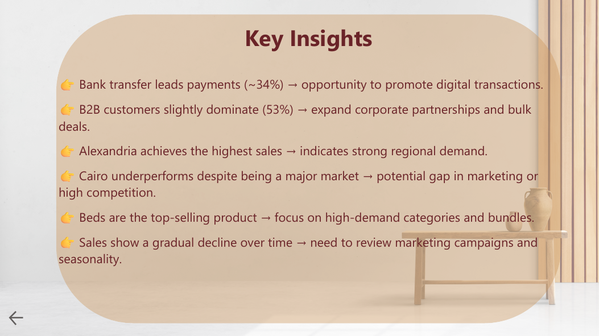

# 🪑 Furniture Sales Dashboard

## 📊 Project Overview
This project presents an interactive **Power BI dashboard** designed to analyze furniture sales performance.

The goal is to transform raw data into meaningful insights that help understand:
- Customer behavior  
- Product performance  
- Sales trends across regions and time  

---

## 🛠 Tools Used
- Excel → Data cleaning & preparation  
- Power BI → Data visualization & dashboard design  

---

## 📷 Dashboard Preview

### 📊 Dashboard Overview

### 📊 Additional View
.png)

### 🏠 Landing Page

### 🧠 Key Insights

---

## 📌 Key Insights
- Bank transfer leads payments (~34%) → opportunity to promote digital transactions  
- B2B customers slightly dominate (53%) → expand corporate partnerships  
- Alexandria achieves the highest sales → strong regional demand  
- Cairo underperforms despite being a major market → potential marketing or competition gap  
- Beds are the top-selling product → focus on high-demand categories  
- Sales show a gradual decline over time → review marketing strategy  

---

## 💡 What Makes This Project Unique
- Designed a **complete user experience** (Landing Page → Dashboard → Insights)  
- Added **insight annotations directly on charts**  
- Focused on **business understanding**, not just visuals  

---

## 📁 Files Included
- Power BI file (.pbix)  
- PDF version of the dashboard  
- Images for preview  

---

## 🚀 Future Improvements
- Use real-world dataset instead of synthetic data  
- Add advanced KPIs and deeper analysis  
- Implement forecasting models for sales prediction  

---

## 👤 Author
**Hussini Eltawil**  
Aspiring Data Analyst | Excel | Power BI  
